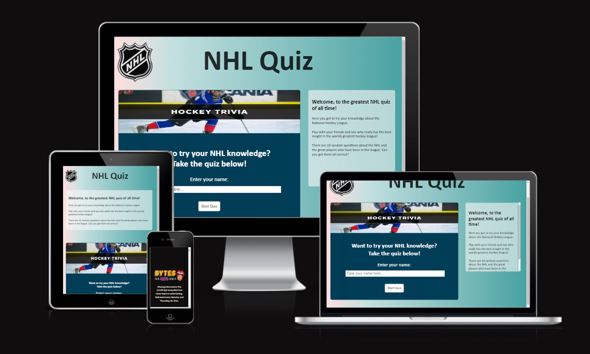
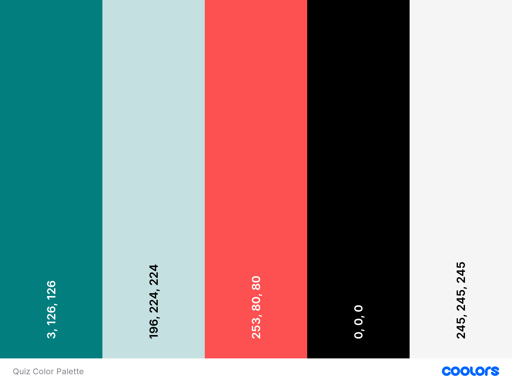
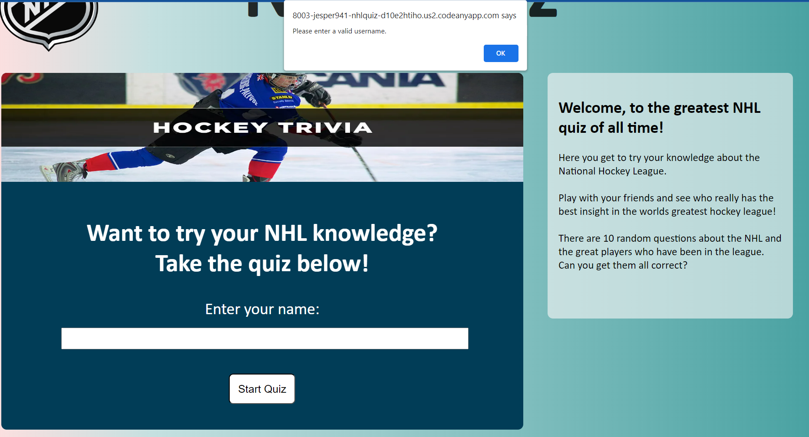
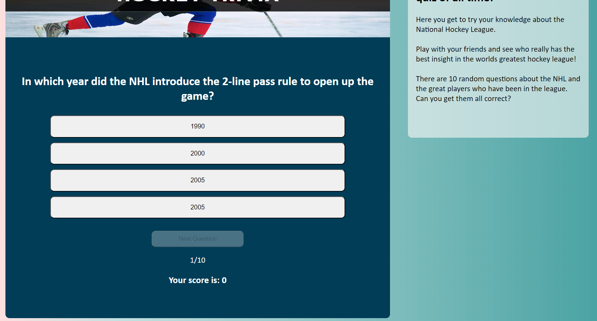
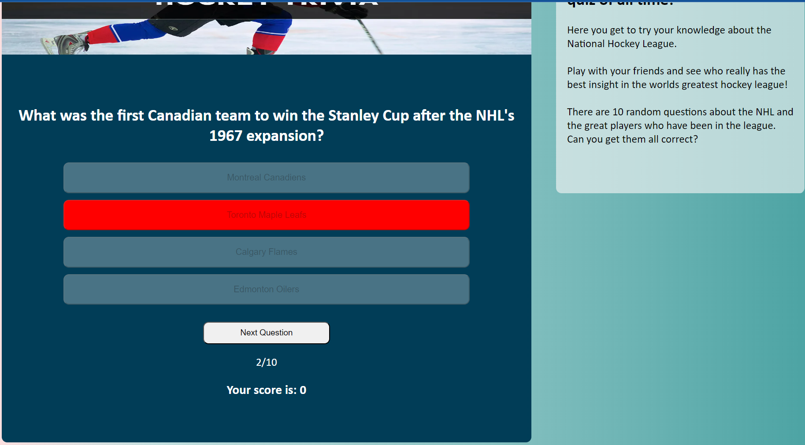
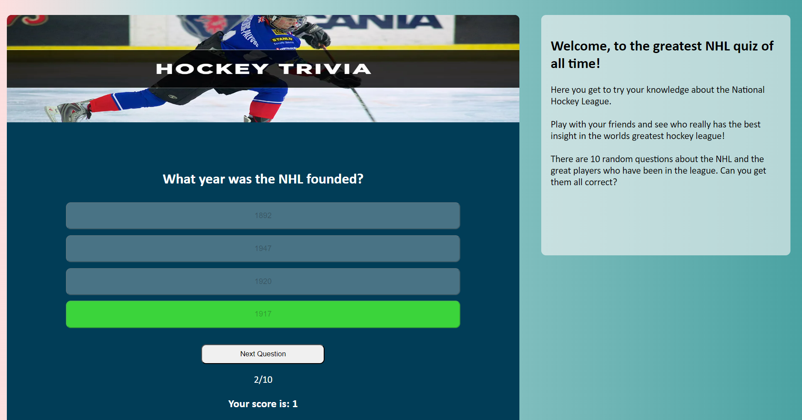
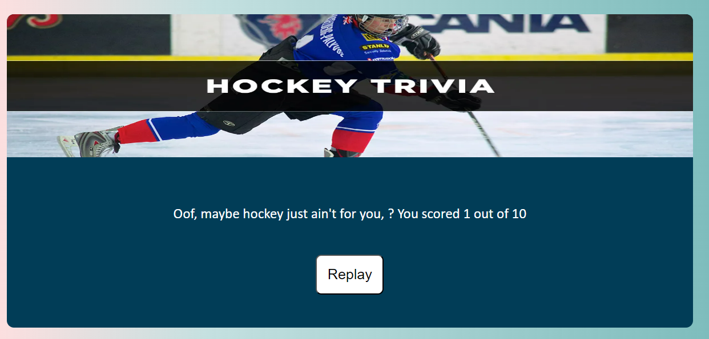
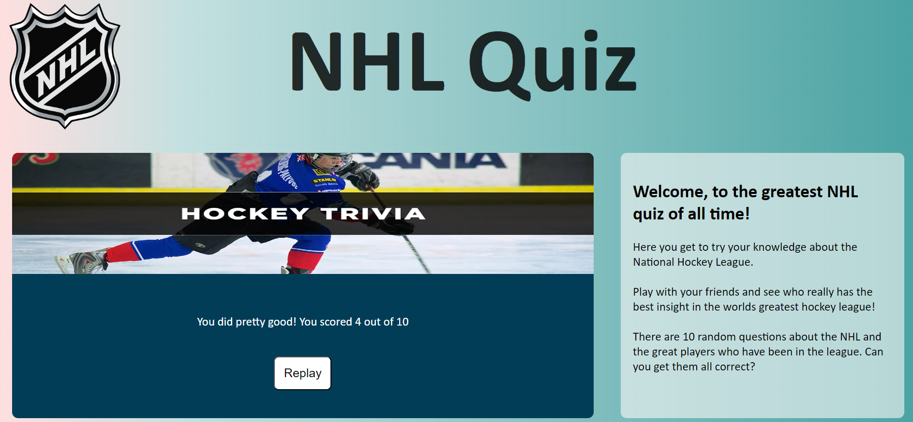
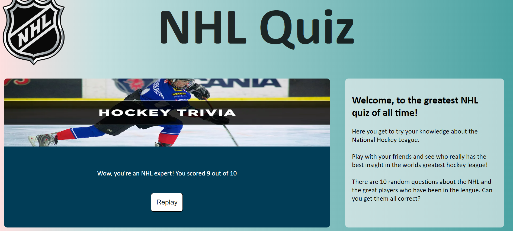
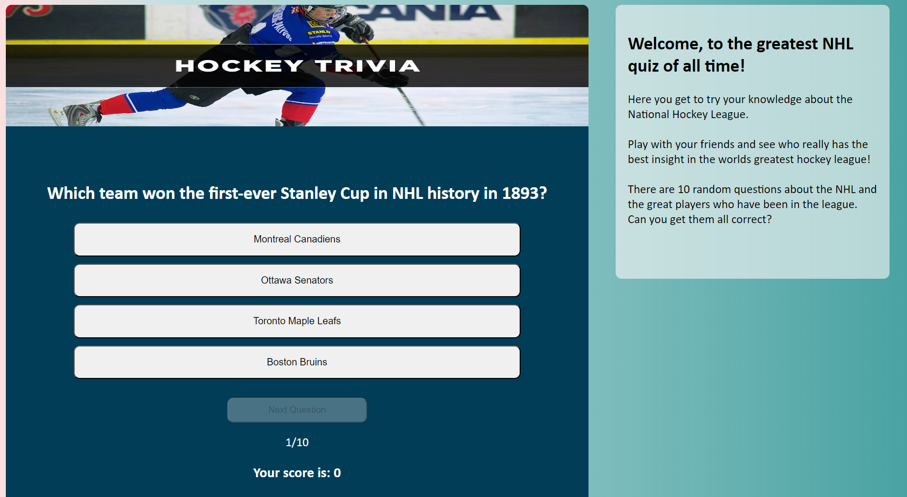

# NHL - QUIZ

"Welcome to the NHL Quiz, a fun and challenging quiz game that tests your knowledge about the National Hockey League (NHL). 
Are you ready to prove your expertise in the world of ice hockey? Let's drop the puck and get started!"

LIVE WEBSITE

You can view a live version of the website here.<https://jesper941.github.io/nhlquiz/>

GITHUB PAGES

You can view the GitHub code pages here. (https://github.com/Jesper941/nhlquiz.git)

## CONTENTS

- [NHL - QUIZ](#nhl---quiz)
  - [CONTENTS](#contents)
      - [Visitors Goals](#visitors-goals)
      - [First-Time Visitor Goals](#first-time-visitor-goals)
      - [Returning Visitor Goals](#returning-visitor-goals)
      - [Frequent Visitor Goals](#frequent-visitor-goals)
  - [Design](#design)
    - [Colour Scheme](#colour-scheme)
    - [Typography](#typography)
    - [Function Styling](#function-styling)
  - [Features](#features)
  - [How to Play](#how-to-play)
    - [Navigation](#navigation)
    - [Future Implementations](#future-implementations)
    - [Accessibility](#accessibility)
  - [Technologies Used](#technologies-used)
    - [Languages Used](#languages-used)
    - [Local Development](#local-development)
      - [How to Fork](#how-to-fork)
      - [How to Clone](#how-to-clone)
  - [Testing](#testing)
  - [Credits](#credits)
    - [Code Used](#code-used)
    - [Content](#content)
    - [Media](#media)
    - [Feedback](#feedback)
  
---

#### Visitors Goals

The main goal for any visitor would be to test their knowledge of the history of the National Hockey League and its players.
Another goal is to see who's the most knowledgeable among their friends or family members.
To spend some time having fun with an interactive and interesting quiz.
Divided into different categories, the visitor's goals may look like this:

#### First-Time Visitor Goals
- I want to see where my NHL knowledge level is at.
- I want to spend a few minutes doing something fun.
- I want to expand my knowledge by taking quizzes.
- I want to see what kinds of questions there are.

#### Returning Visitor Goals
- I want to try and beat my previous score.
- I want to challenge my friends and see who gets the highest score.

#### Frequent Visitor Goals
- I want to see what new questions have been added to further test my knowledge.
- I want to see who can have the most right answers out of me and my friends.

---

## Design

### Colour Scheme

Here is the color palette for the colors that I've used to create this website.

### Typography

I use the "Calibri" font style for the entire website. The backup font styles are set as "Times New Roman, Times, Serif".

### Function Styling

- Starting off with the home page where the visitor has to enter a valid username.
A blank space for their username will not be valid and a message will be prompted as in the picture.

- Once you've entered a valid username, the introduction area will disappear and the quiz will appear.

- If you enter an incorrect answer, the answer you chose will turn red. Your point score will stay the same, and when you hit the "next question" button, the question number counter will increase.
  

- If you answer a question correctly, the question you chose turns green. Your point score will increase by one and as soon as you click the "next question" button, the question number counter will increase. 

- If you end up with a score of 3 or lower, you get the following message. 
  
  
  
- If you end up with a score of 4 and 6, you get the following message. 
  
  
  
- If you end up with a score of 7 or higher, you get the following message. 
  
  

- If you press the "Replay" button by the end of the quiz, you get taken straight back to the first question of the next quiz. 
  
  
  
---

## Features

What does this quiz feature?
10 challenging NHL-related questions.
Multiple-choice answers for each question.
Interactive design with user-friendly buttons.
Real-time scoring to track your progress.
A final score page with personalized feedback.
Replay the quiz to improve your score.

## How to Play

Visit the NHL Quiz webpage.
Enter your name in the provided field.
Click the "Start Quiz" button.
Answer each question by clicking on the multiple-choice options.
Click the "Next Question" button to advance.
After 10 questions, see your final score and feedback.
Click "Replay" to play the quiz again and beat your previous score.

### Navigation

There is really only one page, but the NHL-shield logo in the top left corner will load the index.html and take you back to the beginning of the quiz where you enter your username.

### Future Implementations

- Add a choice for the player on how many questions the quiz should be.
- Add images that show up when the correct answer has been chosen.
- Increase the library, or array, of questions for the quiz.

---

### Accessibility

In order to ensure that the website has good accessibility, I have used different semantic tags,
such as header, main, section, etc.
- I have used an "alt" attribute on the banner image.
- Using colors that mix well together and allow the visitor to easily read the answers, read the options, and find the buttons without struggle.
---

## Technologies Used

### Languages Used

I used HTML and CSS to build this website.

### Local Development

Instructions on how to fork and clone the project.

#### How to Fork

1. Log in (or sign up) to Github.
2. Go to the repository for this project, (https://github.com/Jesper941/nhlquiz.git)
3. Click the Fork button in the top right corner.

#### How to Clone

Log in (or sign up) to GitHub.
1. Go to the repository for this project, (https://github.com/Jesper941/nhlquiz.git)
2. Click on the code button, select whether you want to clone with HTTPS, SSH, or GitHub CLI, and copy the link shown.
3. Open the terminal in your code editor and change the current working directory to the location you want to use for the cloned directory.
4. Type 'git clone' into the terminal and then paste the link you copied in step 3. Press enter.

## Testing

You can find all of the testing done in the [TESTING.md file](TESTING.md)

## Credits

Here i'm gonna list the credits to all the sources that helped me out during this project.

### Code Used

1. Some general tips and tricks from youtuber Brocode and his video: <https://youtu.be/HGTJBPNC-Gw?si=MoPalcBbt6jw2o88>
2. For the stroke text i went here for help: <https://css-tricks.com/adding-stroke-to-web-text/>
3. I took a lot of help from this website when i needed help with coding and styling the pseudo-elements for the links in the nav bar: <https://stackoverflow.com/questions/10143357/how-to-make-these-buttons-not-appear-as-blue-links>
4. For help with coding the responsive flexboxes for my text containers, i took help from the flexbox section of this website: <https://www.w3schools.com/css/css3_flexbox_responsive.asp>
5. To truly understand the meaning and difference between margin and padding, i took help from these sites. <https://www.w3schools.com/css/css_margin.asp> and <https://www.w3schools.com/css/css_padding.asp>
6. i couldn't figure out how to make the text-containers to not go across the full width of the page, so i use some of the code here to learn and use in my text containers: <https://www.w3schools.com/css/css_max-width.asp>
7. I found some help on how to solve blank space validation: https://stackoverflow.com/questions/1151032/javascript-blank-space-validation
8. How to properly use the firstChild property: https://developer.mozilla.org/en-US/docs/Web/API/Node/firstChild
9. How to use the innerText property to change the text of elements after a function or event happens: https://developer.mozilla.org/en-US/docs/Web/API/HTMLElement/innerText

### Content

I wrote the code myself but with some help from the sites and people mentioned above on how to execute my idea.

###  Media

Background image in the header: <https://www.11inchpizza.com.au/wp-content/uploads/2019/10/pizza-ingredients-768x513.jpg>

### Feedback

If you have any feedback or questions, please reach out to me via my email: Jesper941@hotmail.com