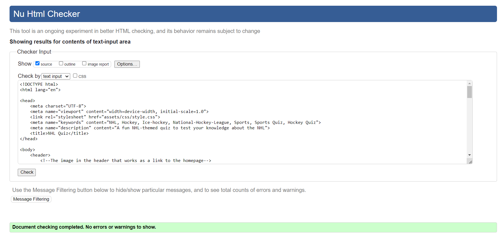
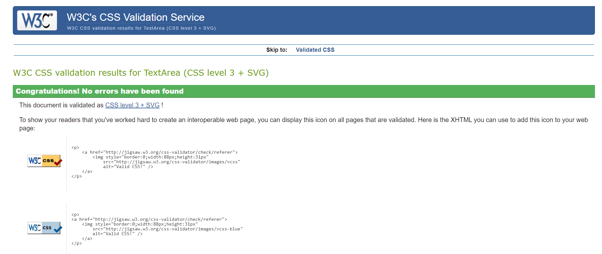
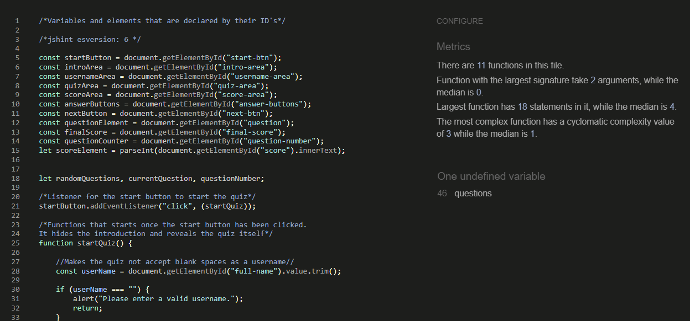
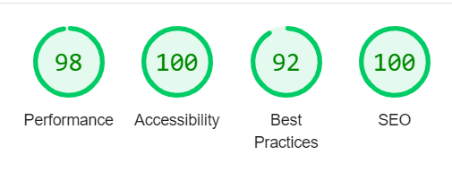
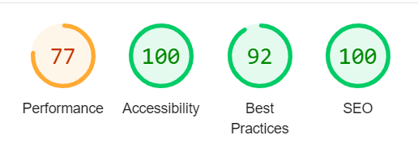

## CONTENTS

- [CONTENTS](#contents)
- [AUTOMATED TESTING](#automated-testing)
  - [W3C Validator](#w3c-validator)
- [Lighthouse](#lighthouse)
  - [LAPTOP RESULTS](#laptop-results)
  - [MOBILE RESULTS](#mobile-results)
  - [Full Testing](#full-testing)
- [Bugs](#bugs)
  - [Known Bugs](#known-bugs)
  - [Solved Bugs](#solved-bugs)

Testing was ongoing throughout the entire project. I used the Chrome developer tools while coding the website to pinpoint and troubleshoot any issues.

I have gone through each step of the quiz using Google Chrome developer tools to ensure that each page is responsive on a variety of different screen sizes and devices.

- - -

## AUTOMATED TESTING

### W3C Validator

[W3C](https://validator.w3.org/) was used to validate the HTML on all pages of the website. It was also used to validate the CSS.

* [Index Page] ( Pass - Checked the "index.html" using https://validator.w3.org/nu/#textarea )

  
  
* [CSS Styling] ( Pass - Checked the CSS styling for the website using  https://jigsaw.w3.org/css-validator/ )

  
  
* [Javascript] ( Pass - Checked the Javascript code using https://jshint.com/

  

## Lighthouse

My Lighthouse score was really good for accessibility both on desktop and mobile.

### LAPTOP RESULTS

HOME PAGE

### MOBILE RESULTS

- - -

### Full Testing

Full testing was performed on the following devices, and additional testing for other devices was carried out using developer tools:

Laptop, Mobile M, Mobile L, and Tablet.

Each device tested the site using the following browsers:

Google Chrome on Windows.

`Index Page`

| Feature | Expected Outcome | Testing Performed | Result | Pass/Fail |
| --- | --- | --- | --- | --- |
| **NAVBAR** |  |  |  |  |
|  |  |  |  |  |
| `Header` |
| NHL Shield Logo | Redirects to home page | Click on the NHL-shield logo | Redirects to home page | Pass |
| `Home Page` |
| Enter a blank username | Get alert to enter valid username | Enter a username with blank spaces | Alerted to enter valid username | Pass |
| Start Quiz Button | Start the quiz | Click the start button | Started the quiz | Pass |
| Answer Button | Register an answer based on the button selected | Click an answer button | Registered answer | Pass |
| Answer Button - Incorrect Answer | Answer to turn red | Click an incorrect answer | Button turned red | Pass |
| Answer Button - Correct Answer | Answer to turn green | Click a correct answer | Button turned green | Pass |
| Answer Button - Other buttons | Other buttons become unclickable | Click any answer | Other buttons became unclickable | Pass |
| Replay Button | Start the quiz again | Click "Replay" button | Quiz started again | Pass |
|  |  |  |  |  |

## Bugs

### Known Bugs

| Known Bug No | Bug Issue | Plan to Resolve |
| :--- | :--- | :--- |
| 1 |  | :--- |

### Solved Bugs

| Bug No | Bug Issue | How Resolved |
| :--- | :--- | :--- |
| 1 |  | :--- |
